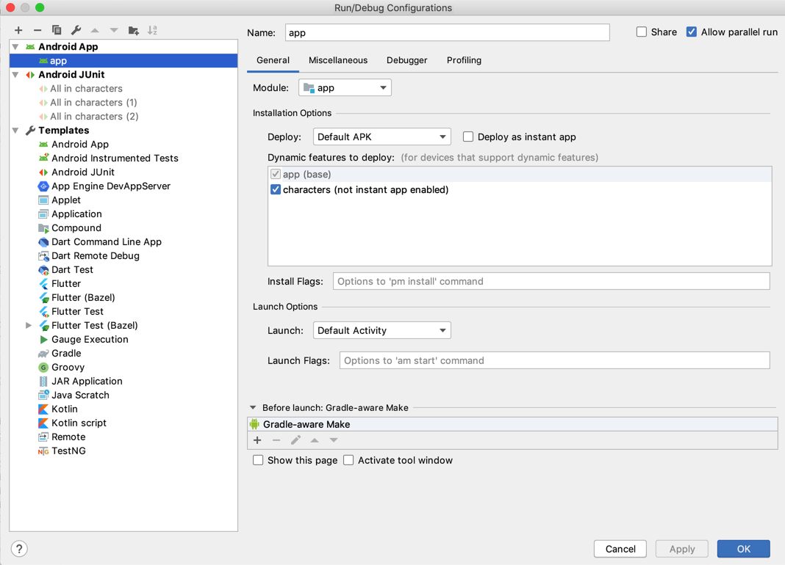

#  Starwars Android app

This sample app has been developed with Kotlin following an MVVM architecture pattern with a modular approach for given **[Challenge.](challenge.md)**

# Working

# Framework
* **[Koin](https://github.com/InsertKoinIO/koin)**: Dependency injection
* **[Reactive streams](https://github.com/ReactiveX/RxJava)**: Networking & Async.
* **[LiveData and ViewModel](https://developer.android.com/topic/libraries/architecture)**: Isolate business logic and maintain state.

# Decisions
* **Koin**: Koin is a simple powerful Dependency injection framework for Kotlin. Written in pure Kotlin using functional resolution only: no proxy, no code generation, no reflection!

* **Modular**: The app is developed with a modular approach to support following:

  * Faster gradle builds
  * Re-usability of common functionality across applications / modules
  * Easily pluggable into Instant apps
  * Better team work, as one person can have the sole responsibility of a module
  * Smoother git flows

# Structure
* `app` module is where the application initialises.
* `characters` dynamic module is where our sample screens reside. 
* `CharacterActivity` holds the `CharacterSearchFragment` & `CharacterDetailsFragment`.
* The packages are "by-feature" for easier access.

# Running
You will need a device / emulator with Android Oreo (API 27) and up.

# Testing
Test cases for the [`CharacterSearchVM`](characters/src/test/java/com/karntrehan/starwars/characters/search/CharacterSearchVMTest.kt) & [`CharacterDetailsVM`](characters/src/test/java/com/karntrehan/starwars/characters/details/CharacterDetailsVMTest.kt) have been implemented using 
* `junit` : A unit testing framework
* `robolectric` : A framework that brings fast and reliable unit tests to Android. 
* `mockitoKotlin` : A small library that provides helper functions to work with Mockito in Kotlin.
* `aacTesting` : Test helpers for LiveData

# Contribution
Feel free to open an issue or submit a pull request with improvements.

# Licence
    MIT License
    
    Permission is hereby granted, free of charge, to any person obtaining a copy
    of this software and associated documentation files (the "Software"), to deal
    in the Software without restriction, including without limitation the rights
    to use, copy, modify, merge, publish, distribute, sublicense, and/or sell
    copies of the Software, and to permit persons to whom the Software is
    furnished to do so, subject to the following conditions:
    
    The above copyright notice and this permission notice shall be included in all
    copies or substantial portions of the Software.
    
    THE SOFTWARE IS PROVIDED "AS IS", WITHOUT WARRANTY OF ANY KIND, EXPRESS OR
    IMPLIED, INCLUDING BUT NOT LIMITED TO THE WARRANTIES OF MERCHANTABILITY,
    FITNESS FOR A PARTICULAR PURPOSE AND NONINFRINGEMENT. IN NO EVENT SHALL THE
    AUTHORS OR COPYRIGHT HOLDERS BE LIABLE FOR ANY CLAIM, DAMAGES OR OTHER
    LIABILITY, WHETHER IN AN ACTION OF CONTRACT, TORT OR OTHERWISE, ARISING FROM,
    OUT OF OR IN CONNECTION WITH THE SOFTWARE OR THE USE OR OTHER DEALINGS IN THE
    SOFTWARE.    